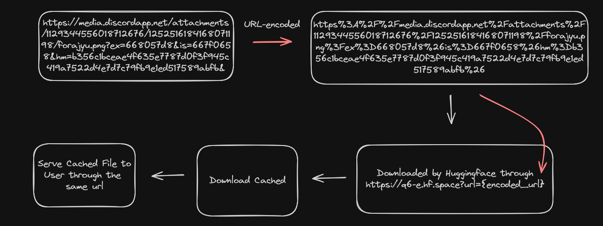

# Link to Direct Download Link
Ever wanted to convert download a png, jpeg, mp4 but the image opens in a new tab instead of downloading or just tired of right clicking and clicking Save As... Didn't think so but here, here I made a "proxy" service to use huggingface to download & cache any url and provide a direct download link for the user.

I also added some extra features, mostly for my own use to mask image metadata & download youtube videos as mp3 but it's also included in the repo.

## Flowchart

## Usage
You can run it yourself using main.py, or you can visit some of my huggingface space
Flask: https://q6-e.hf.space
Gradio: https://q6-d.hf.space

Using this rainbow cat as example: https://storage.googleapis.com/pod_public/1300/151089.jpg
Encoded Url: https%3A%2F%2Fstorage.googleapis.com%2Fpod_public%2F1300%2F151089.jpg
DDL with rename as Base26 (Default): https://q6-e.hf.space?url=https%3A%2F%2Fstorage.googleapis.com%2Fpod_public%2F1300%2F151089.jpg
DDL with original filename: https://q6-e.hf.space?url=https%3A%2F%2Fstorage.googleapis.com%2Fpod_public%2F1300%2F151089.jpg&a=0
DDL with removed metadata (PNG): https://q6-e.hf.space?url=https%3A%2F%2Fstorage.googleapis.com%2Fpod_public%2F1300%2F151089.jpg&b=1
DDL with fake metadata (PNG): https://q6-e.hf.space?url=https%3A%2F%2Fstorage.googleapis.com%2Fpod_public%2F1300%2F151089.jpg&c=1
DDL to mp3 of https://www.youtube.com/watch?v=q8LXRPnaqrs: https://q6-e.hf.space/yta?url=https%3A//www.youtube.com/watch%3Fv%q8LXRPnaqrs

or... just use my Gradio version, which does not need the hassle of encoding the url. The flask version is more of an api for my discord bot.